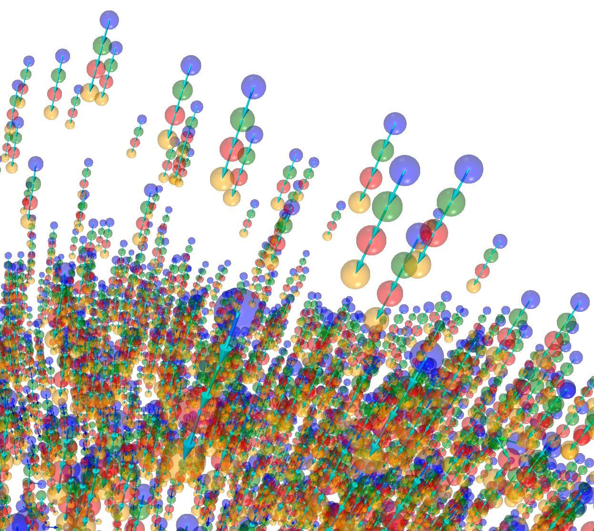
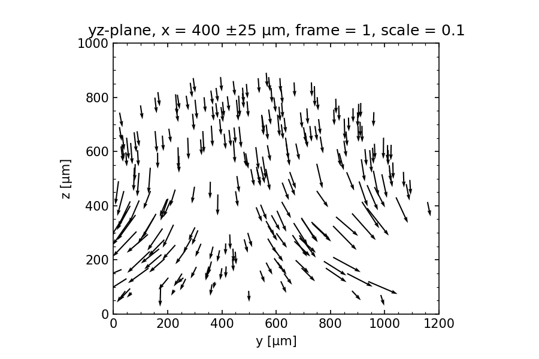
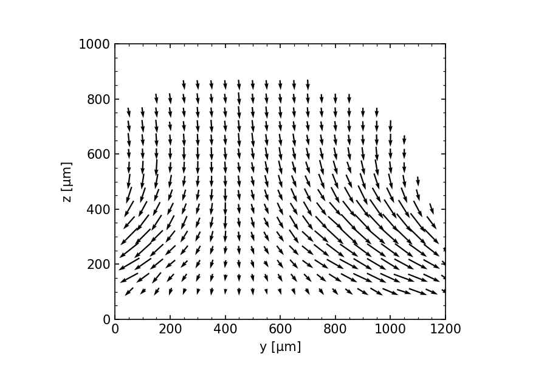
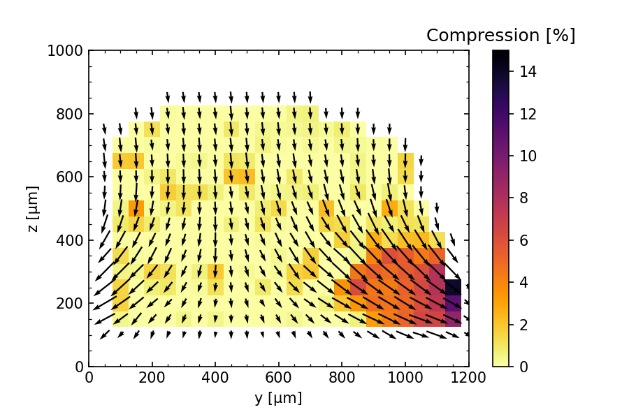
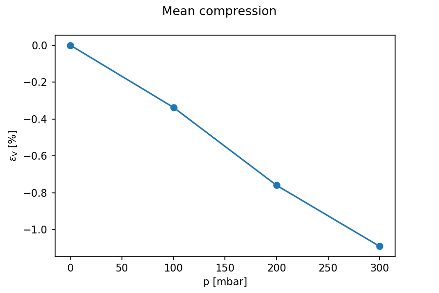

# Beadops - Package for operations on microscope data of fluorescent beads

The package provides helper functions for tracking fluorescent beads in z-stacks, linking beads, and calculating the space-resolved compression.
Particles are tracked with [trackpy](https://github.com/soft-matter/trackpy) and visualized in 3D with [vedo](https://github.com/marcomusy/vedo).
See [beadops_walkthrough.ipynb](beadops_walkthrough.ipynb) for example usage.

### Purpose

In my usecase I wanted to determine the space-resolved compression of a hydrogel within a microfluidic chip. Therefore, fluorescent beads are embedded in the gel and z-stacks are recorded to determinee the bead positions in 3D. Varying pressures are applied to the device, leading to a hydrogel compression. For each pressure the bead positions are determined from z-stacks. The bead positions are linked between bead configurations at varying pressures to determine the displacement field. The displacement field is further interpolated and the space-resolved compression calculated from the Jacobian determinant.

### Input

- z-stacks are stored as series of .tif-files for each applied pressure in a separate folder
- the folders are named to contain the applied pressure: `[spacing]um-[pressure]mbar-dz` such that the pressure can be extracted by a parsing function from the folder string

### Output

- Extracted particle tracks can be visualized in 3D (interactive version [figs/linked_3D.html](https://htmlpreview.github.io/?https://github.com/ilorevilo/beadops/figs/linked_3D.html)):
	
- Cutplanes of linked particles:
	
- Cutplanes of interpolated displacements
	
- Cutplanes of interpolated displacements with overlain compression:
	
- pressure-dependent mean compression:
	

### To do
- unify and clean up plotting functions
- add vedo plotting function for showing links with arrows
- clean up trajectory filtering functions